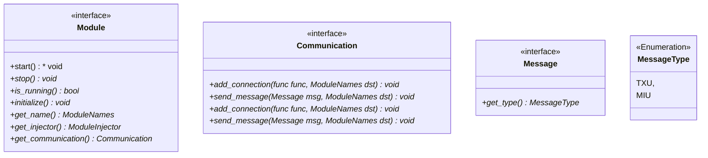

# perfect-lib

```mermaid             

classDiagram

class Module {
    <<interface>>
    +start() * void
    +stop()* void
    +is_running()* bool
    +initialize()* void
    +get_name()* ModuleNames
    +get_injector()* ModuleInjector 
    +get_communication()* Communication
}

class Communication {
    <<interface>>
    +add_connection(func<void (Message, ModuleNames)> func, ModuleNames dst)* void  
    +send_message(Message msg, ModuleNames dst)* void
}

class Communication {
    <<interface>>
    +add_connection(func<void (Message, ModuleNames)> func, ModuleNames dst)* void  
    +send_message(Message msg, ModuleNames dst)* void
}

class Message {
    <<interface>>
    +get_type()* MessageType     
}

class MessageType {
    <<Enumeration>>
    TXU, 
    MIU
}


```
